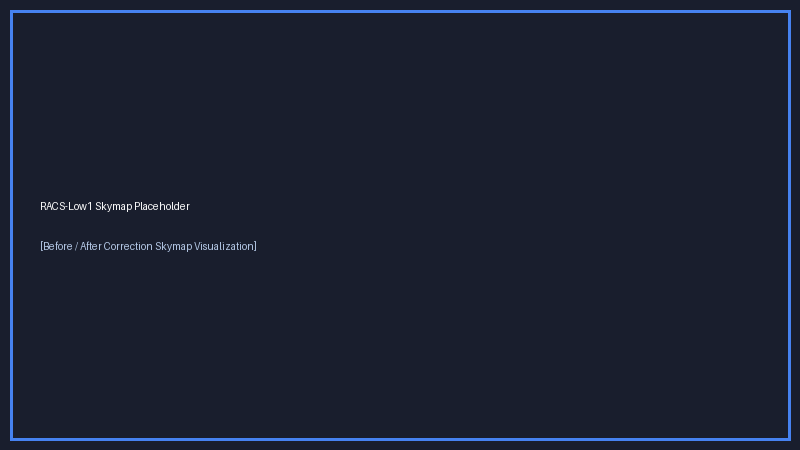
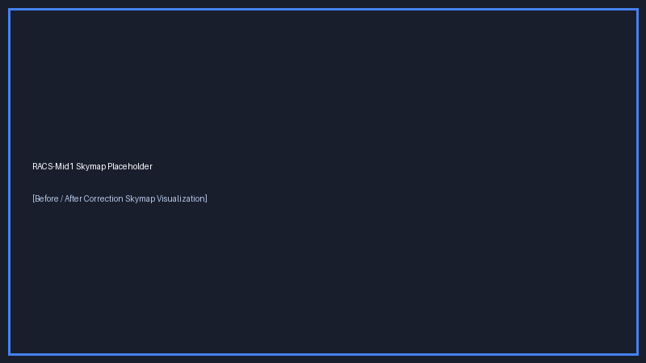
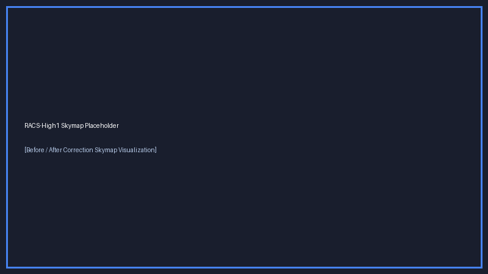

# Rapid ASKAP Continuum Survey (RACS) Astrometric Corrections

Primary research codebase (2023–2026) developed as part of PhD research on systematic astrometric corrections for the Rapid ASKAP Continuum Survey (RACS).

> [!WARNING]
> ### ⚠️ Code Dump & Reproducibility Disclaimer
> **This repository is a static archive / code dump of the PhD research codebase.**
> It is published to provide open technical transparency for the associated methodology papers. **Users should NOT attempt to reproduce the publication results using this codebase in its current form.** A standardized, fully reproducible software package may be published here in a future update.

> [!IMPORTANT]
> ### 📡 Unmosaicked Per-Beam Source Lists Disclaimer
> The unmosaicked per-beam source lists referenced and processed by these notebooks are intended for **expert users** familiar with ASKAP/RACS data processing and beam topology.
> For full survey details, header definitions, and survey parameters, please visit the [Official RACS Website](https://research.csiro.au/racs/home/data-2/).

---

## 📚 Scientific Publications & Citation Context

This codebase provides the methodology, cross-matching routines, and positional calibration algorithms described in the following publication series:

1. **Part 1 (RACS-Low1 & RACS-Low3)**:
   - **Publication**: PASA Paper ([DOI: 10.1017/pasa.2025.28](https://doi.org/10.1017/pasa.2025.28))
   - **arXiv**: Preprint ([arXiv: 2503.14856](https://arxiv.org/abs/2503.14856))
   - **Scope**: Astrometric calibration and systematic correction of RACS-Low epoch 1 (887.5 MHz) and epoch 3 (887.5 MHz).

2. **Part 2 (RACS-Mid1 & RACS-High1)**:
   - **arXiv**: Preprint ([arXiv: 2607.18775](https://arxiv.org/abs/2607.18775))
   - **Scope**: Extension of astrometric calibration to higher frequency RACS epochs: RACS-Mid1 (1367.5 MHz) and RACS-High1 (1655.5 MHz).

---

## 🔗 Corrected Catalogues & External Data References

### Corrected Catalogues Data Links
- **RACS-Low1 Data Release**: [https://doi.org/10.57891/6ksa-md85](https://doi.org/10.57891/6ksa-md85)
- **RACS-Low3 Data Release**: [https://doi.org/10.57891/z4gk-at64](https://doi.org/10.57891/z4gk-at64)
- **RACS-Mid1 & RACS-High1 Data Release**: *To be updated upon final release*

### CSIRO Bitbucket Data Reference Note
For details on source list formats, header definitions, and raw catalogue access, refer to the official [CSIRO RACS Bitbucket Repository](https://bitbucket.csiro.au/projects/ASKAP_SURVEYS/repos/racs/browse):
- **`epoch_0`**: RACS-Low1
- **`epoch_9`**: RACS-Low3
- **`epoch_1`**: RACS-Mid1
- **`epoch_5`**: RACS-High1

---

## 📁 Repository Structure

```
RACS_Astrometry/
├── utils/                  # Shared core Python modules and reference catalogs
│   ├── RACSQuery.py        # TAP and sky coordinate query engine
│   ├── RACSUtils.py        # Astrometric correction models, fitting, & coordinate transformations
│   ├── get_VLASS_cutout_url_ed.ipynb  # CADC VLASS cutout retrieval tool
│   └── RFC_PointSources.npy           # Radio Fundamental Catalog reference array
│
├── RACS-Low1/              # Epoch 1 (Low-band, 887.5 MHz) calibration pipeline & arrays
├── RACS-Low3/              # Epoch 3 (Low-band, 887.5 MHz) calibration pipeline & arrays
├── RACS-Mid1/              # Epoch 1 (Mid-band, 1367.5 MHz) calibration pipeline & arrays
└── RACS-High1/             # Epoch 1 (High-band, 1655.5 MHz) calibration pipeline & arrays
```

---

## 📽️ Visual Demonstrations & Before/After Correction Skymaps

### Pipeline Video Demonstration

https://github.com/user-attachments/assets/2e2c30ab-8fdd-43dc-861d-8b003edc9e88

*Demonstration of systematic astrometric corrections for a sequence of RACS-Low1 scans sharing a common bandpass calibration. The bottom-left panel displays raw, uncorrected positional offsets across all beams and scans. The top panels show the derived beam-independent and scan-independent correction models, while the bottom-right panel highlights the residual offsets post-calibration. A direct comparison between the bottom panels demonstrates the dramatic reduction in systematic positioning errors across the survey fields.*

### Epoch Skymaps

#### RACS-Low1

*Figure 1: Before and after astrometric correction positional offset distribution across the RACS-Low1 survey sky.*

#### RACS-Low3

*Figure 2: Position offset distribution for RACS-Low3 relative to optical/radio reference catalogues before and after correction.*

#### RACS-Mid1

*Figure 3: Astrometric alignment improvements for RACS-Mid1 fields.*

#### RACS-High1

*Figure 4: Astrometric alignment improvements for RACS-High1 fields.*

---

## 🛠️ Usage Notes & Dependencies
- **Core Dependencies**: Python 3.9+, `numpy`, `scipy`, `pandas`, `astropy`, `astroquery`, `matplotlib`.
- Shared utility modules `RACSQuery.py` and `RACSUtils.py` inside `./utils/` are imported across all epoch analysis notebooks.


---

## 📄 License

This repository is licensed under the [MIT License](LICENSE).
